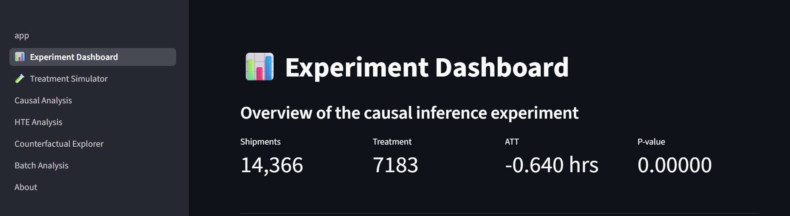
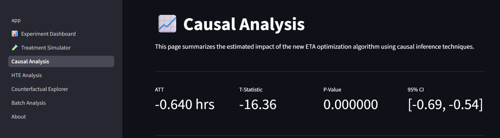
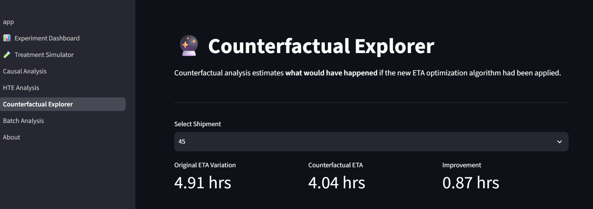
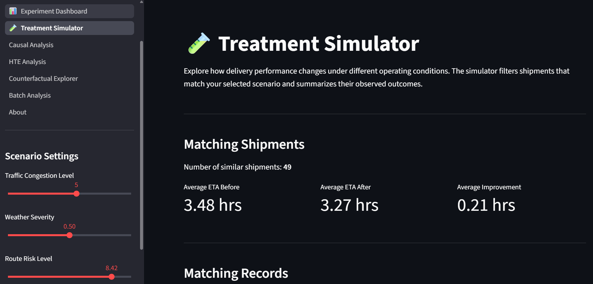
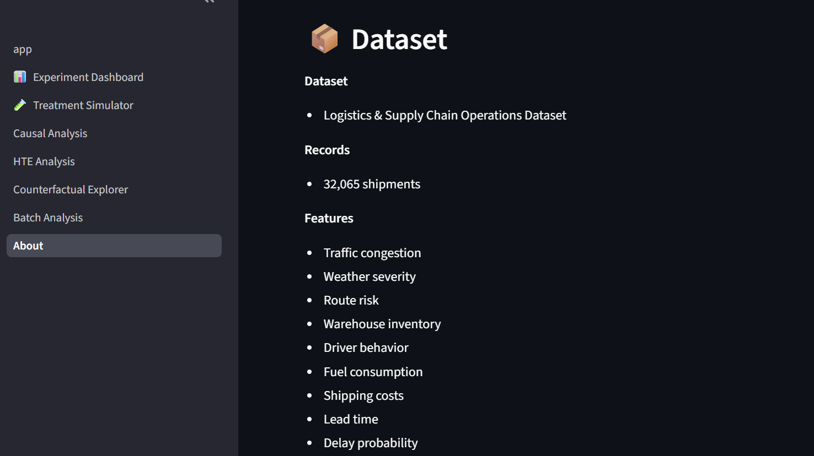

#  Google Maps ETA Optimization using Causal Inference

###  Live Demo

**[Open the Causal Inference ETA Optimization Dashboard](https://app-maps-project-gamlcxsratb7r7eci4cknt.streamlit.app/)**

> Interactive Streamlit application for exploring treatment effects, counterfactual outcomes, and ETA optimization insights.

---

##  Project Overview

Modern navigation and logistics platforms constantly improve their Estimated Time of Arrival (ETA) algorithms. But just because delivery times improve after implementing a new algorithm doesn't mean the algorithm caused the improvement.

This project develops a **Causal Inference Framework for ETA Optimization** to estimate the true effect of a new ETA optimization algorithm, accounting for confounders such as traffic, weather, route risk, and operational conditions.

The idea is to move from prediction to answering:
> **"Did the new ETA algorithm actually improve delivery performance?"**

---

#  Business Problem

Logistics companies frequently roll out new routing and ETA algorithms.

A simple before-and-after comparison can be misleading because delivery performance is affected by:

- Traffic jam
- Weather
- Challenge of the route
- Warehouse activities
- Behavior of the driver
- Changes in demand

This project uses causal inference methods to estimate the **counterfactual outcome**:
>  What would the delivery performance look like if we did not deploy the new ETA algorithm?

---

#  Solution Approach

The project follows an end-to-end causal inference workflow:

Data
 ↓
Prepare
 ↓
Experiment Design
 ↓
Causal Modeling
 ↓
Impact Measurement
 ↓
Deep Dive Analysis
 ↓
Decision Support

---

# 📸 Application Preview

##  Experiment Dashboard

The dashboard provides an overview of the experiment, including shipment volume,
treatment allocation, ATT, and statistical significance.

---

##  Causal Analysis

The causal analysis page presents the estimated treatment effect, t-statistic,
p-value, and 95% confidence interval.

---

##  Counterfactual Explorer

The counterfactual explorer allows users to compare observed ETA variation with
the estimated outcome under the new ETA optimization algorithm.

---

##  Treatment Simulator

The treatment simulator allows users to explore how algorithm performance varies
under different traffic, weather, and route-risk conditions.

---

## About the Project

The About page documents the dataset, causal inference methodology, technology
stack, business impact, and skills demonstrated in the project.

---

#  Dataset

## Logistics & Supply Chain Operations Dataset

### Dataset Size

- 32,065 shipment records

### Important Features

| Category | Features |
|---|---|
| Traffic | Traffic congestion level |
| Weather | Weather severity |
| Route | Route risk level |
| Operations | Warehouse inventory, loading time |
| Vehicle | Fuel consumption, driver factors |
| Business | Shipping cost, lead time |
| Outcome | ETA variation |

---

#  Causal Inference Methodology

## 1. Treatment Definition

The intervention was defined as:
Treatment = New ETA Optimization Algorithm
Control = Existing ETA Algorithm

The purpose was to estimate if the new algorithm decreased ETA variance.

---

## 2. Propensity Score Matching (PSM)

Similar treatment and control shipments were matched on operational characteristics to minimize selection bias .

Variables matched on included:

- Traffic conditions
- Weather severity
- Route risk
- Operational factors

This creates a more balanced comparison between groups.

---

## 3. Average Treatment Effect on the Treated (ATT)

The primary metric was:

ATT = Impact of the new ETA algorithm on shipments receiving the treatment

The analysis estimated:

- Treatment effect size
- Statistical significance
- Confidence intervals

---

## 4. Statistical Testing
The project assesses the statistical significance of the observed improvement by:

- Hypothesis testing
- T-statistics
- P-values
- 95% confidence intervals

---

## 5. Heterogeneous Treatment Effects (HTE)

Not every shipment benefits equally. Hence the project investigates the effects of treatment on:

- High vs low traffic conditions
- Weather severity groups
- Route risk categories

This helps answer:

> "Where should the ETA algorithm be deployed first?"

---

## 6. Counterfactual Analysis

Counterfactual modeling estimates:

Observed Outcome:

What actually happened?

vs

Counterfactual Outcome:

What would have happened without the intervention?

This allows for impact analysis at the shipment level.

 --- 

 #  Key Outcomes

The results of the causal analysis are as follows:

ATT (Average Treatment Effect on Treated): -0.625 hours

- Equivalent improvement: ≈ 37.5 minutes reduction in ETA variation

- Statistical significance: p-value < 0.001

- 95% Confidence Interval: (-0.700, -0.549) hours

Results show that the ETA optimization algorithm provided a statistically significant improvement in delivery reliability.

 
--- 

#   Dashboard with Streamlit

The project has an interactive analytics dashboard with:

## Summary on Dashboard

- Shipping statistics
- Comparison of treatment and control
- ATT metrics 
- Significant statistically# Cause and Effect Study

- Summary of treatment effects
- Visualization of confidence intervals
- Business analysis## Treatment Effects Heterogeneity

- Impact analysis based on traffic
- Impact assessment based on weather
- Route risk assessment# Counterfactual Explorer 

- Comparison of shipments

Observed versus predicted counterfactual outcomes# Batch-Analyse

- Add new datasets
- Analyze distribution of shipments
- Download processed data

 --- 

 
#   Tech Stack 

## Coding

- Python 
- pandas
- numpy

## Causal Inference & Machine Learning

- scikit-learn;
- EconML library
- XGBoost

# Stats

- SciPy Python
- Statsmodels

## Explainability

- SHAP Visualisation

- Plotly 
- Matplotlib 

## Deployment 

 - Streamlit 

--- 

#   Project Layout

	

| File / Folder | Description |
|---------------|-------------|
| `app.py` | Main Streamlit application |
| `pages/` | Multi-page dashboard modules |
| `data/` | Processed datasets and analysis outputs |
| `images/` | Images used in the application and README |
| `models/` | Saved models and experiment artifacts |
| `requirements.txt` | Project dependencies |
| `README.md` | Project documentation |

--- 

# Business Impact

This project demonstrates how causal inference can support operational decisions by:

- Measuring true algorithm impact
- Reducing misleading A/B comparisons
- Identifying high-value deployment scenarios
- Supporting data-driven rollout decisions

Instead of asking:

"Did delivery times improve?"

The framework answers:

"Did the new ETA algorithm cause delivery improvement?"

--- 

# Skills Demonstrated

- Causal Inference
- Propensity Score Matching
- Treatment Effect Estimation
- Counterfactual Reasoning
- Statistical Testing
- Heterogeneous Treatment Effects
- Feature Engineering
- Machine Learning
- Data Visualization
- Streamlit Deployment

